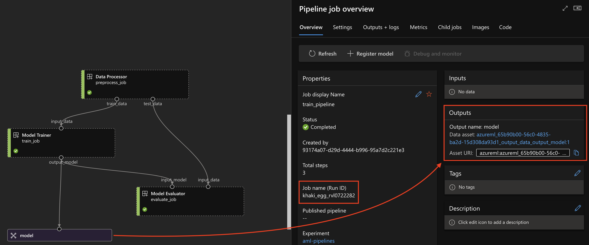
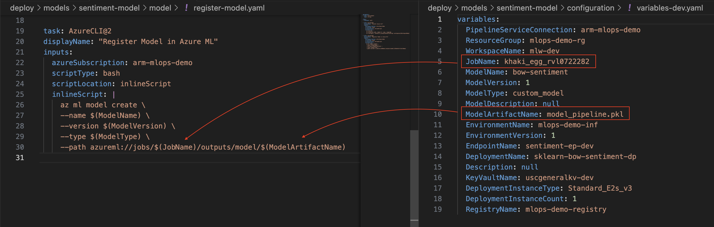
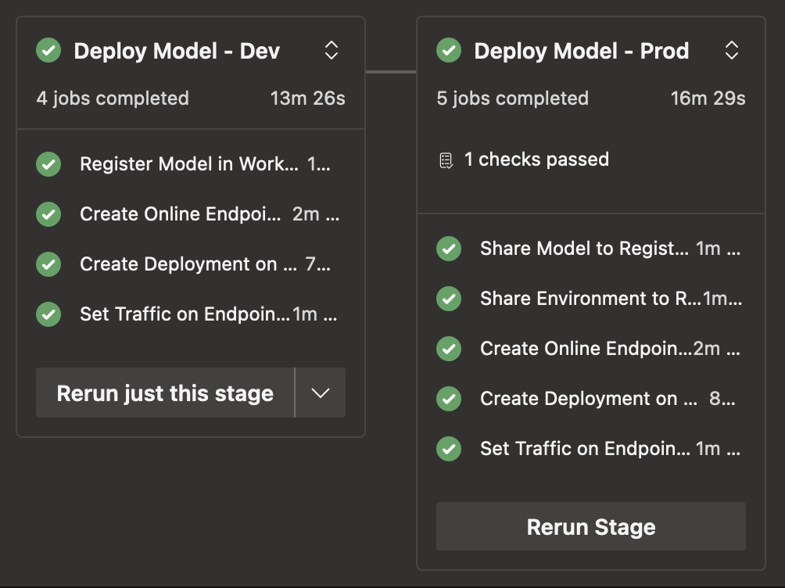

# Azure Machine Learning Deployment Pipeline  

This repository demonstrates how to create and deploy a machine learning model using Azure Machine Learning and Azure Pipelines. The core features are:

1. Code to train a simple bag-of-words sentiment model using an Azure Machine Learning pipeline job.
2. Deployment scripts to deploy the model to two environments: dev and prod.


## Demonstrated Workflow

### Model Training

An MLOps workflow can vary in terms of sophistication with automated training/retraining, automatic model promotion, drift detection, etc. This repository assumes a model was trained using an Azure Machine Learning job and **the model to be deployed is an output of said job**. The image below demonstrates how we can use a Job ID to deploy a model that is an output of a pipeline job.

<br/>
<p align="middle">
  
  <br/>
  <em>Azure Machine Learning training job with a trained model as a pipeline ouput.</em>
</p>
<br/>

<br/>
<p align="middle">
  
  <br/>
  <em>Use of training Job ID when registering model in Azure ML Workspace.</em>
</p>
<br/>

The `src` directory of this repository contains the source code used to train the model, with the code to orchestrate the training job is located in `notebooks/pipeline-train.ipynb`.

### Model Deployment

Model deployment in this repository entails deploying the model to "dev" and "prod" Azure ML workspaces. The image below summarizes the steps involved in each environment.

<br/>
<p align="middle">
  
  <br/>
  <em>Dev and prod stages and their subsequent tasks for the Azure deployment pipeline.</em>
</p>
<br/>

For deployment to the "dev" environment, the required steps are:

1. Register the model in the Azure ML workspace.
2. Create a managed online endpoint.
3. Create a deployment to the endpoint using the registered model and environment.
4. Allocate endpoint traffic.

For deployment to the "prod" environment, the required steps are:

1. Share the registered model from the "dev" environment to the Azure ML Registry.
2. Share the registered environment from the "dev" environment to the Azure ML Registry.
3. Create a managed online endpoint.
4. Create a deployment to the endpoint using the shared model and environment.
5. Allocate endpoint traffic.

A few items are worth addressing.

1. **When does the environment get registered in the dev deployment?**

    The environment gets registered when running the training job (see training notebook), so we don't have to register it during deployment.

2. **Why doesn't the model get registered as a part of the training pipeline?**

    This is a design decision. The rationale is that we register a model only after deciding it is the one we want to productionalize.

3. **Why do we have to use the Registry to promote the model from dev to prod?**

    In Azure ML, it is best practice to use the registry to share a model between workspaces (e.g., between dev and prod workspaces). This prevents the need to retrain the model in each workspace.


## Project Structure  

```plaintext  
.
├── LICENSE
├── README.md
├── deploy/
│   ├── inference/                      # placeholder directory for a possible inference pipeline
│   └── models/                         # directory structure to support multiple models
│       ├── sentiment-model/
│       │   ├── configuration/          # contains variables for deployment
│       │   ├── deployment/
│       │   ├── endpoint/
│       │   ├── environment/
│       │   ├── model/
│       │   ├── deployment-dev.yaml     # jobs required for dev deployment
│       │   ├── deployment-prod.yaml    # jobs required for prod deployment
│       │   └── release-pipeline.yaml   # stage-level pipeline specification
│       └── summarization-model/
├── docs/
├── environments/
├── notebooks/
│   ├── exploration.ipynb
│   └── pipline-train.ipynb             # contains code to orchestrate training pipeline
└── src/                                # code used for model training
    ├── evaluate.py
    ├── preprocess.py
    ├── score.py
    ├── train.py
    └── utils/
```


## Continued Work

1. Add infrastrcture code. Currently, the creation of the workspace, computes, keyvaults, service principal, etc were all done manually using the Azure Portal.

2. Add YAML-based pipeline definitions. Currently, the training pipeline is created using the Python SDK in a notebook. For version control purposes, YAML-based pipeline definitions would be more appropriate.  

## License  

This project is licensed under the MIT License.
